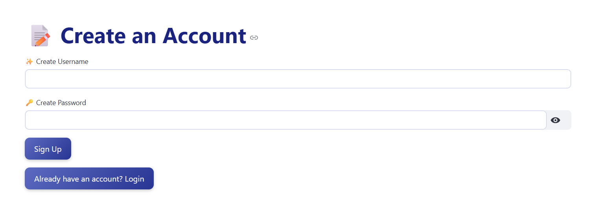
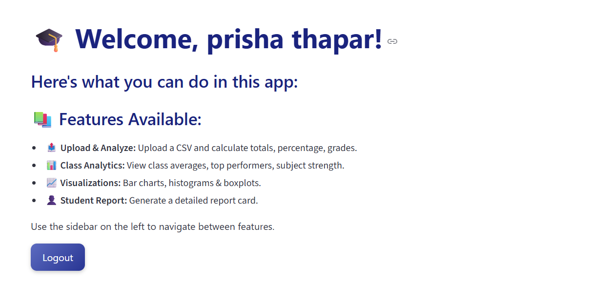
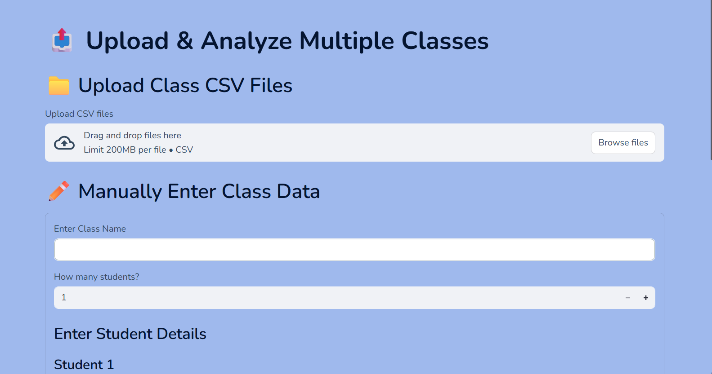
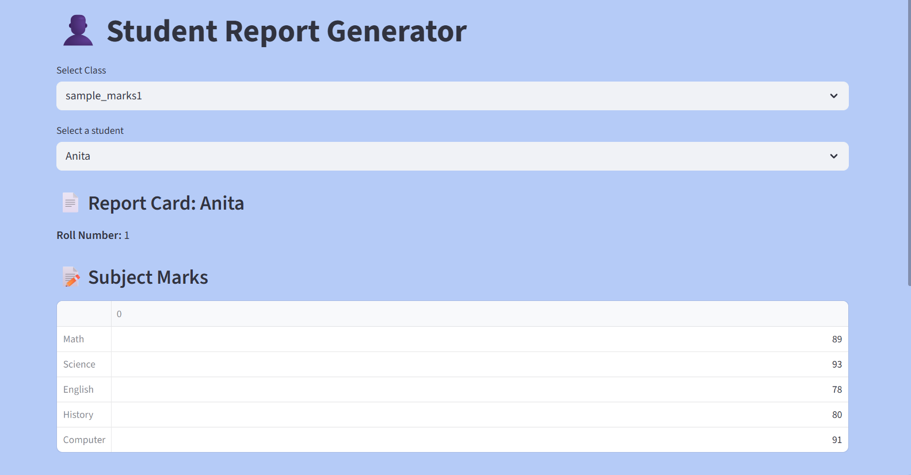
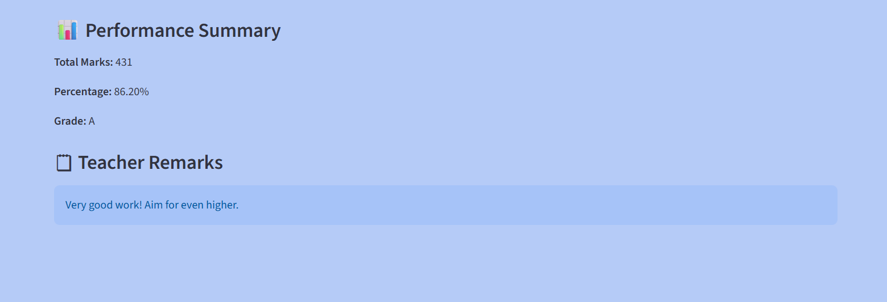
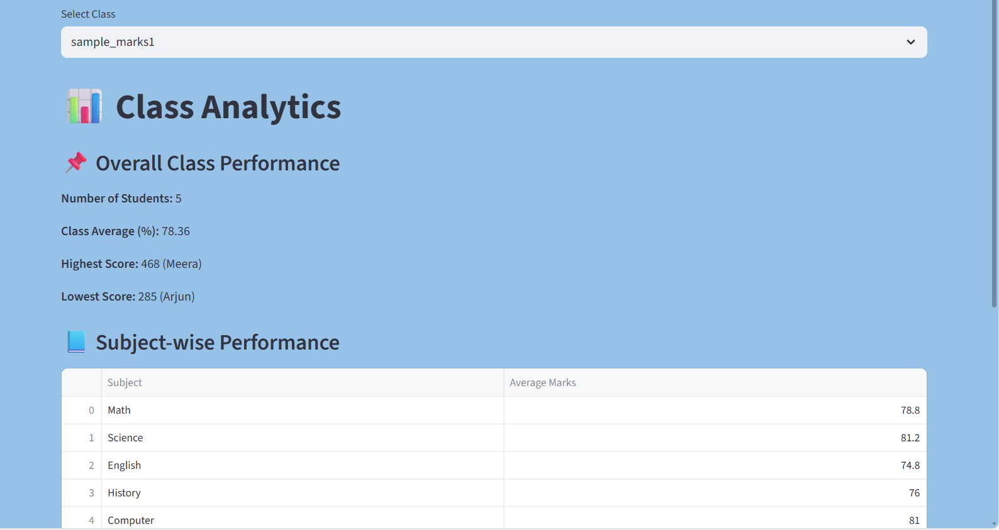
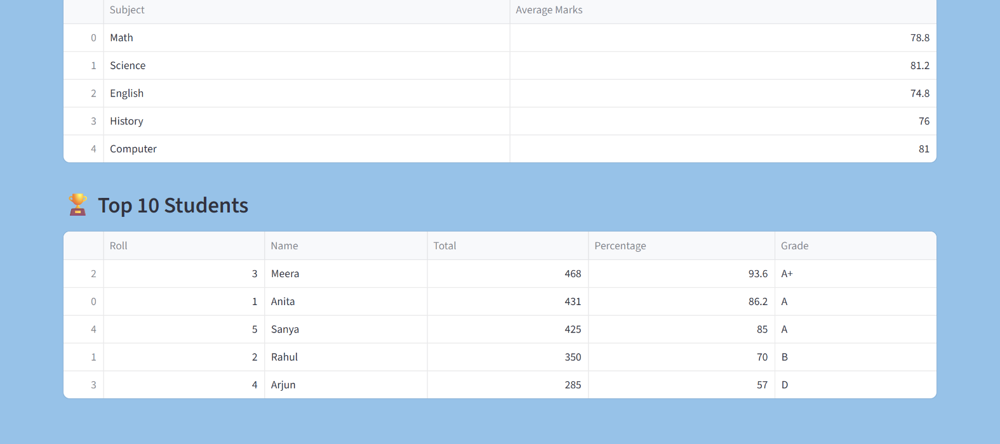
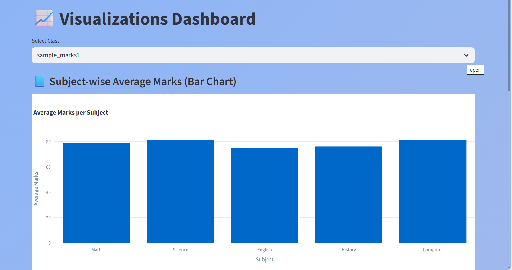
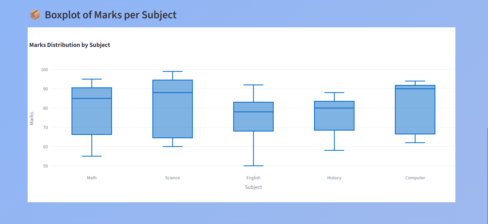

# 🌟 Student Marks Analyzer

A beautifully interactive Streamlit dashboard for analyzing student performance across multiple classes — CSV upload + manual entry + reports.

🚀 Live Demo

👉 App URL: Add your Streamlit link here after deployment

✨ Features
### 📁 Upload Multiple Class CSVs
- Upload **one or more CSV files** at once.
- Auto-validate required columns.
- Automatically calculate **Total**, **Percentage**, and **Grade**.
- Each class is **stored separately** for easy access later.

### ✏️ Manual Data Entry
- Enter **any number of students manually**.
- Auto-generate **Roll Numbers**.
- Clean and intuitive **UI for entering marks**.
- Uses the **same processing pipeline** as CSV upload.

### 📊 Class & Student Analytics
- View **summary metrics** for the class.
- Prepare **visualization-ready datasets**.
- Export processed datasets as **.CSV files** for sharing or reporting.

### 🎨 Aesthetic & Smooth UI
- Custom **soft-colored backgrounds**.
- Modern **Nunito font** for readability.
- Clear highlights for **headers and sections**.
- Neat layout using **columns** for a dashboard feel.
- Interactive buttons with hover effects.

---

## 🛠️ Tech Stack
- **Python**
- **Streamlit**
- **Pandas**
- **Plotly / Matplotlib** (optional for charts)
- Designed for **easy deployment on Streamlit Community Cloud**

---

## 📌 How It Works
1. **Upload CSV or manually enter data**.
2. System **calculates totals, percentages, grades** automatically.
3. View **processed data** and **analytics**.
4. Export or download **clean, processed CSVs**.
5. Navigate through the dashboard for **class and student insights**.

---

## 🎯 Highlights
- Works with **multiple classes at once**.
- Supports **dynamic data entry**.
- Modern **UI + UX design** for effortless analysis.
- **Lightweight and responsive**, deployable anywhere.

---

## 🔗 Deployment
- Deploy on **Streamlit Community Cloud**.
- Push the repository to **GitHub**, connect to Streamlit, and get a **live link** to share.

📂 Project Structure
📦 StudentMarksAnalyzer
│
├── app.py                      # Main entry file
├── pages/
│   ├── 1_📥_Upload_and_Analyze.py
│   ├── 2_✏️_Manual_Entry.py
│   └── 3_📊_Class_Reports.py
│
├── utils/
│   └── helpers.py
│
├── data/                       # Your processed/saved data
├── requirements.txt
└── README.md

📸 Screenshots

Replace the images in /assets/ folder and update paths.

🏠 Login Page

🏠 Home Page

📤 CSV Upload

✏️ Student Report

📊 Class Analytics

📊 Visualizations

